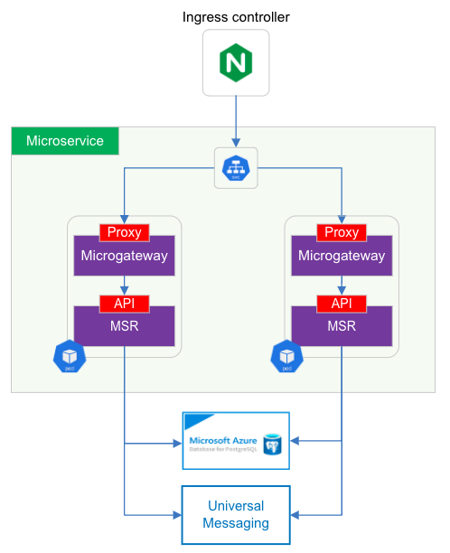

# webMethods microservice showcase

This repo contains various assets to showcase the use of the webMethods Microservice Runtime (MSR) to implement a customer management microservice.
The microservice exposes a REST API that is relayed and secured by the webMethods microgateway.
It also publishes an event to a Universal Messaging JMS destination each time a customer is updated through the API, so that interested applications (subscribers) are made aware of the changes.

The microgateway connects to an external API Gateway (not represented in the picture) to fetch its configuration.
Both the microgateway and the microservice runtime expose metrics endpoints that are periodically scrapped by Prometheus.

We have:
- the content of the webMethods package itself
- the application.properties file, which allows the configuration of various MSR resources (JDBC adapter, JNDI & JMS settings, etc) using environment variables
- a Dockerfile together with its .dockerignore file, which serve to build the microservice image
- the API Swagger specification (Open API Specification v2) under resources/api
- the Docker deployment script under resources/deployment/docker
- the Kubernetes sidecar deployment manifest files under resources/deployment/kubernetes-side-car
- Kubernetes manifest files with the other deployment option that exists, in which the Microgateway and the MSR each have their own deployment & service
- A Grafana report under resources/monitoring (which need to be reworked)
- Some assets for automated testing under resources/test
- Two CI/CD pipelines for Azure Pipelines azure-pipelines-sidecar.yml and azure-pipelines.yml, together with the scripts under resources/buildScripts

## Microservice implementation

We follow the recommended layered approach:
- a customerCanonical document type defining the Customer object
- a jdbc folder containing the JDBC adapter services
- a service folder containing the flow services, which invoke the JDBC adapter services to access the database and use the Customer document type
- an API layer containing the REST API descriptor and the mapping between the API methods and the flow services

There's not much difference between an API implemented in the "traditional" Integration Server and one implemented in a Microservice Runtime. It's the configuration, packaging and deployment that differ.

## Microservice configuration

We want our image to be "environment agnostic". The very same image will go to QA, UAT and later Production.
Everything that is environment specific needs to be externalized: connection to backend APIs, databases, messaging brokers, etc.
Same principle for the operating properties, such as the log level.

The MSR lets us provide a properties files to inject everything that is environment specific.
There are two ways to provide this file to the container:
- it can be outside the image and mounted into the container
- or it can be inside the image and point to environment variables that are passed to the container when it is launched

We use the second option here.
