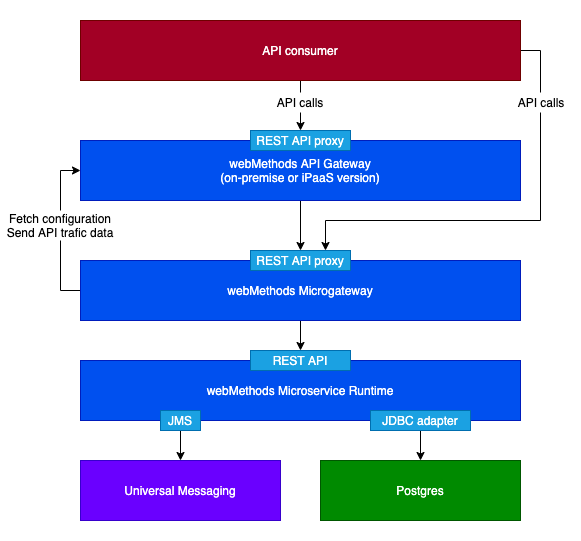
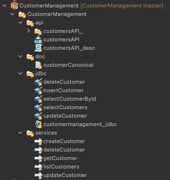

# webMethods microservice showcase

This repo contains various assets to showcase the use of the webMethods Microservice Runtime (MSR) to implement a customer management microservice, which can be deployed in Kubernetes using a CI/CD pipeline.

The microservice is plugged to a Postgres DB using the webMethods JDBC adapter.
It exposes a REST API that is relayed and secured by the webMethods microgateway, which connects to an external API Gateway in order to fetch its configuration and send API trafic logs.
It this setup, API consumers can either call APIs through the API Gateway or directly through the microgateway.

The microservice also publishes an event to a Universal Messaging JMS destination each time a customer is updated through the API, so that interested applications (subscribers) are made aware of the changes.

Both the microgateway and the microservice runtime expose metrics endpoints which can be periodically scrapped for monitoring purposes.

## Repository contents

Refering to the logical architecture, this repository contains assets relating the microservice runtime and the microgateway.

We have:
- the content of the webMethods MSR package itself, which connects to the database, universal messaging and exposes the REST API
- the application.properties file, which allows the configuration of various MSR resources (JDBC adapter, JNDI & JMS settings, etc) using environment variables
- a Dockerfile together with its .dockerignore file, which serve to build the microservice image
- the REST API Swagger specification (Open API Specification v2) under resources/api
- the Docker deployment script under resources/deployment/docker
- the Kubernetes sidecar deployment manifest files under resources/deployment/kubernetes-side-car and resources/deployment/kubernetes (we have two deployment topologies to choose from)
- A Grafana report under resources/monitoring (which need to be reworked)
- Some assets for automated testing under resources/test
- Two CI/CD pipelines for Azure Pipelines azure-pipelines-sidecar.yml and azure-pipelines.yml, together with the scripts under resources/buildScripts

## Microservice implementation

We follow the recommended layered approach:
- a customerCanonical document type defining the Customer object
- a jdbc folder containing the JDBC adapter services
- a service folder containing the flow services, which invoke the JDBC adapter services to access the database and use the Customer document type
- an API folder containing the REST API descriptor and the mapping between the API methods and the flow services

There's not much difference between an API implemented in the "traditional" Integration Server and one implemented in a Microservice Runtime. The microservice specificities are at configuration, packaging and deployment levels.

## Microservice external configuration

We want our image to be "environment agnostic". The very same image will go to QA, UAT and later Production.
Everything that is environment specific needs to be externalized: connection to backend APIs, databases, messaging brokers, etc.
Same principle for the operating properties, such as the log level.

The MSR lets us provide a properties files to inject everything that is environment specific into the microservice container.
There are two ways of providing this file to the container:
- it can be outside the image and mounted into the container
- or it can be inside the image and point to environment variables that are passed to the container when it is launched

We use the second option here.

In both cases, we need to pass the location of the properties file to the MSR container using the SAG_IS_CONFIG_PROPERTIES environment variable.

## Microservice build and push

A Dockerfile is provided to build the microservice container image.
The base image is staillansag/webmethods-microservicesruntime:10.15.0.2-jdbc, which I created myself. It's the base MSR image provided in https://containers/softwareag.com, to which I have added the WmJDBCAdapter package along with the required JAR drivers.

In the Dockerfile we copy the content of the github repo (the content of the webMethods package), two configuration files related to JNDI and JMS and a few configuration files related to the hybrid integration with webmethods.io

The Github repo also contains some assets that are not meant to be part of the Docker image, so we use a .dockerignore file to ensure we don't place things like the Kubernetes deployment manisfests, README pictures or CI/CD scripts into the image.

You would then push the image to any registry of your liking. It's a Docker image like any other.

## Microgateway configuration

## Docker deployment

## Kubernetes deployment

### Side car deployment

### Microgateway and MSR as standalone deployments

## Monitoring with Prometheus and Grafana

## Agregation of application logs using FluentD

## CI/CD with Azure Pipelines (and Newman for the automated tests)

## External dependencies

### Postgres database

### Universal messaging

### API gateway

