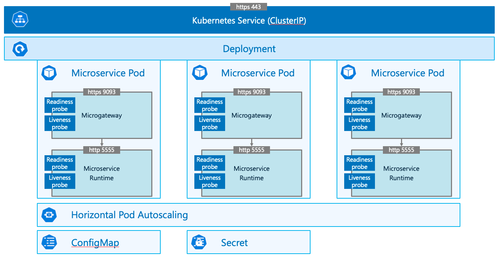
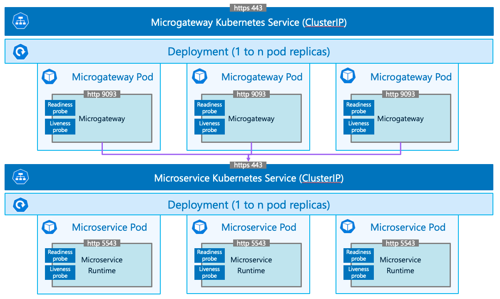

# Kubernetes deployment

## Deployment topologies

Two options exist to deploy the microgateway in the Kubernetes cluster.

### Side car deployment



Each pods contains a microgateway container that sits next to the MSR container (hence the "sidecar" name.) The former is the only entry point to the API, the latter is never exposed to the "outside world."

It's the best deployment option to govern East - West traffic in the microservice architecture (API trafic between all the microservices.) Uncontrolled management of these dependencies can indeed severely impact the evolutivity of microservices.

### Microgateway and MSR as standalone deployments



Another deployment option is to have the microgateway and the microservice as standalone pod deployments.

While loosing the East - West governance capabilities, it creates opportunities to optimize the use of infrastructure resources. The microgateway and MSR can scale independently, and you could even decide to use your microgateway deployment to protect several microservices.

## Kubernetes cluster configuration

See [this other Github repository](https://github.com/staillansag/wm-config/tree/main/aks) for a pipeline that automatically creates an AKS cluster.

If you want to create your cluster manually, here are the requirements for this microservice.

### Cluster specifications

I usually run a single node cluster with 4 vCPUs and 16 Gb RAM (Azure Standard_B4ms.)
The cluster hosts some monitoring tools (Prometheus, Grafana) and one or two microservices.

If you're just looking at deploying the present microservice, then 2 vCPUs and 8 Gb RAM would probably work (Azure Standard_B2ms.)
Each microservice pod requests 600 mCPU (300 mCPU for the microgateway and 300 mCPU for the microservice runtime.)
Memory wise, the deployment requests 1,5 Gb per pod (500 Mb for the microgateway and 1 Gb for the microservice.)

### Ingress installation

ingress-nginx needs to be installed in your cluster.
You can do it with the help of a helm chart.

```
helm install ingress-nginx ingress-nginx/ingress-nginx \
    --create-namespace \
    --namespace $NAMESPACE \
    --set controller.service.annotations."service\.beta\.kubernetes\.io/azure-load-balancer-health-probe-request-path"=/healthz \
    --set controller.service.annotations."service\.beta\.kubernetes\.io/azure-dns-label-name"=${CLUSTER_NAME}"ingress"
```

The installation will usually take a couple of minutes.
Notice the service.beta.kubernetes.io/azure-dns-label-name annotation, which tells Azure to register a domain name ${CLUSTER_NAME}"ingress".${AZURE_REGION}.cloudapp.azure.com for the ingress.
Very convenient because you no longer have to deal with IP addresses. You have a fixed, predictable address to access your ingress and call the APIs.

Even better, if you own a domain name you can map it with this ingress address using a CNAME DNS entry.

### TLS

If you have associated your ingress to your own domain in the previous step, you can also obtain a TLS certificate for this domain.
In this case use the following command to configure a TLS secret:

```
kubectl create secret tls aks-tls --key="${TLS_KEY_FILE}" --cert="${TLS_CERT_FILE}" 
```
Where ${TLS_KEY_FILE} point to the file containing your certificate private key, and ${TLS_CERT_FILE} contains the full public certificate chain.
Both files need to be in DER format.


### Microservice runtime and Microgateway licenses

You need to create a licenses secret containing your MSR license and Microgateway with this command

```
kubectl create secret generic licenses \
    --from-file=msr-license=${MSR_LICENSE_FILE} \
    --from-file=mcgw-license=${MCGW_LICENSE_FILE}
```
Here ${MSR_LICENSE_FILE} and ${MCGW_LICENSE_FILE} point respectively to the location of your MSR license file and microgateway license file in your hard drive.

### Container registry secrets

I am pulling images located in public Docker hub repositories, so I don't need to provide any connection credentials.
But if you're pulling images from private repositories, you need to create a Kubernetes secret to connect to it, using this command:
```
kubectl create secret docker-registry regcred \
    --docker-server=${SAG_DOCKER_URL} \
    --docker-username=${SAG_DOCKER_USERNAME} \
    --docker-password=${SAG_DOCKER_PASSWORD} \
    --docker-email=${EMAIL_ADDRESS}
```
Then you would have to reference this secret in your Kubernetes deployment manifests.

### Environment configuration

You need a ConfigMap and a Secret, which contain information to connect to various external resources such as the database and API gateway.

Command to create the ConfigMap:
```
kubectl create configmap environment-config \
    --from-literal=apiGatewayUrl=${API_GATEWAY_URL} \
    --from-literal=domainName=${DOMAIN_NAME} \
    --from-literal=databaseServerName=${DB_SERVERNAME} \
    --from-literal=databaseServerPort=${DB_PORT} \
    --from-literal=databaseName=${DB_NAME} \
    --from-literal=jndiAliasProviderUrl=${JNDI_ALIAS_PROVIDER_URL}
```
Note: ${JNDI_ALIAS_PROVIDER_URL} is the URL to connect to the Universal Messaging realm.

Command to create the secret:
```
kubectl create secret generic environment-secrets \
	--from-literal=databaseUser=${DB_USER} \
	--from-literal=databasePassword=${DB_PASSWORD} \
    --from-literal=apiGatewayUser=${API_GATEWAY_USER} \
    --from-literal=apiGatewayPassword=${API_GATEWAY_PASSWORD}
```

## Sidecar deployment

To deploy our microservice the "sidecar" way, we need to apply the Kubernetes manisfest files that are here: [resources/deployment/kubernetes-side-car](../deployment/kubernetes-side-car)

The following command will do the job (assuming you are in the folder where the yaml files are located)
```
kubectl apply -f .
```

01_msr-customer-management_deployment.yaml creates a deployment of pods.
Each pod has two containers: the microgateway and the microservice runtime.
We make use of environment variables to pass the connection details for the database, universal messaging, API gateway, etc.
There's just one pod replica to start with.
The strategy is set to rolling update, we tell Kubernetes to update the pods without any interuption of service and specify that pods must be updated one by one.

02_msr-customer-management_service.yaml creates a service to load balance the traffic to the pods.
We only map the microgateway port, the MSR ports shall never be directly accessible. We want to whole of our API trafic to go through the microgateway.

03_msr-customer-management_hpa.yaml creates the horizontal pod autoscaler (HPA). In our deployment we start with just one replica. But if the load increases the HPA automatically creates new pods. It will also destroy pods when the load decreases.

99_ingress.yaml creates the ingress. It is some sort of reverse proxy that routes the HTTP traffic to the service. 
It can also deal with TLS termination.
Here I provide my domain name as well as the reference to my TLS secret aks-tls.

## Microgateway and MSR as standalone deployments

To deploy our microservice the "standalone" way, we need to apply the Kubernetes manisfest files that are here: [resources/deployment/kubernetes](../deployment/kubernetes)

The following command will do the job (assuming you are in the folder where the yaml files are located)
```
kubectl apply -f .
```

01_msr-customer-management_deployment.yaml creates a deployment of MSR pods.
We still use environment variables to pass the connection details to the external resources.
We still start with 1 pod replica and use a rolling update strategy.

02_msr-customer-management_service.yaml creates a service for the MSR. it's only a ClusterIP service so the MSR will still not be accessible from outside the cluster.

03_mcgw-customer-management_deployment.yaml creates a deployment of Microgateway pods.
We still use environment variables to pass the connection details to the API gateway.
Notice the URL passed in mcgw_aliases_customermanagement_be_url_endPointURI, we point to the DNS name exposed by the MSR service. So the Microgateway will route its traffic to the MSR service.
We still start with 1 pod replica and use a rolling update strategy.

04_mcgw-customer-management_service.yaml creates a service for the Microgateway.

05_msr-customer-management_hpa.yaml creates the horizontal pod autoscaler (HPA) for the MSR deployment.

99_ingress.yaml creates the ingress.