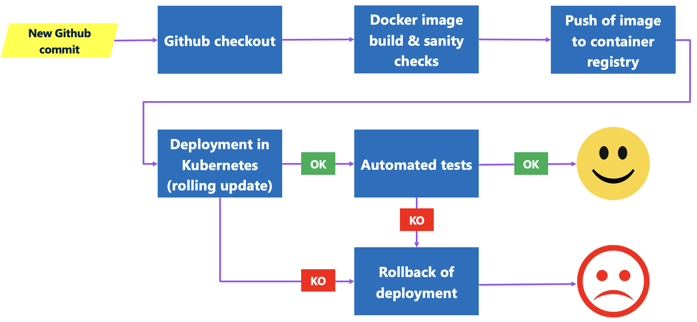

# CI/CD

I'm using Azure Pipelines for the CI/CD part, but any CI/CD tool would work. 
There's no Software AG specificity in the pipelines, we're working with typical Docker images.

At a high level, my pipeline looks as follows:


## Prerequisites

### Azure Pipelines agent

I am using a local Azure Pipelines agent running in a Docker host.
To create and register this agent [you can follow this Microsoft learning page.](https://learn.microsoft.com/en-us/azure/devops/pipelines/agents/docker)

Some tools have to be installed in this agent:
- the Docker CLI
- kubectl
- newman, along with its prerequisites nodejs and npm

You can simply connect to your container using the following command:
```
docker exec -it -u 0 <dockerID> sh
```

And then run the following commands:

```
curl -fsSL https://get.docker.com -o get-docker.sh && sh get-docker.sh
curl -LO "https://dl.k8s.io/release/$(curl -L -s https://dl.k8s.io/release/stable.txt)/bin/linux/amd64/kubectl" > /dev/null
install -o root -g root -m 0755 kubectl /usr/local/bin/kubectl
apt install -y nodejs
apt install -y npm
npm install -g newman
```

### AKS cluster

The AKS prerequisites [are described here.](./AKSDeployment.md)

## External configuration

The pipelines use two Azure Pipelines variable groups.

### global-variables

AKS_CLUSTER_NAME: the name of your AKS cluster
AKS_RESOURCE_GROUP: the resource group in which your AKS cluster is located
AZ_SP_ID: the ID of an Azure Service Principal which has at least contribute rights in your AKS cluster
AZ_SP_SECRET: the secret associated to the Azure Service Principal
AZ_TENANT_ID: the ID of your Azure tenant

### customer-management-options

DOCKER_REGISTRY_URI: the address of your Docker registry. if you're using Docker hub then its docker.io
DOCKER_REGISTRY_ID: ID of a user which has write access to this registry. If you're using Docker Hub then it's your Docker Hub ID
DOCKER_REGISTRY_SECRET: secret of this user

API_ENDPOINT: the endpoint to call the microservice's REST API via the microgateway
API_KEY: the API key to call the microservice's REST API (see External Dependencies, API gateway)

API_GATEWAY_URL: URL to the API gateway, where the microgateway fetches its configuration
API_GATEWAY_USER: User name of an admin user in this API gateway
API_GATEWAY_PASSWORD: Password of this admin user

DB_SERVERNAME: database server name
DB_PORT: database server port
DB_NAME: database name (for this project it should always contain "sandbox")
DB_USER: database user
DB_PASSWORD: password of the database user

JNDI_ALIAS_PROVIDER_URL: URL of the Universal Messaging realm. Since we're connecting with nhsp it should be of the form nhps://<UM-domain-name>

IMAGE_TAG_BASE: microservice base image in the form <id>/<repoName>
IMAGE_MAJOR_VERSION: major version number
IMAGE_MINOR_VERSION: minor version number

Note: with each build, a new image named `$IMAGE_TAG_BASE:$IMAGE_MAJOR_VERSION.$IMAGE_MINOR_VERSION.$BUILD_NUMBER` is created, where $BUILD_NUMBER is an internal ID coming from the CI/CD pipeline execution context.

### Pipelines description

We have one pipeline (and so one yaml file) [for each Kubernetes deployment flavour I have presented](./AKSDeployment.md)

## Build

The build is managed in script ./resources/buildScripts/build.sh

We do a Docker login, build the image and push it to the container registry.

## Kubernetes deployment

### Sidecar deployment

Before doing the deployment we connect to the ASK cluster using resources/buildScripts/connectAKS.sh
Then we run script resources/buildScripts/deployKubernetesSidecar.sh

We start by creating an environment variable with the reference of the current deployement. In case anything goes wrong we can do a rollback to this reference.

We create (or recreate) a ConfigMap and a Secret using values coming from the customer-management-options variable group. These will be used to connect to the database, to the API gateway, etc.

When then apply the Kubernetes manifests that are in resources/deployment/kubernetes-side-car
resources/deployment/kubernetes-side-car/01_msr-customer-management_deployment.yaml point to the latest version of the microservice image, but for better transparancy we replace it with the explicit version number using a sed command.
This allows us to know which image version is live.

We wait for the deployment to complete using the "kubectl rollout status deployment" command. Since we're doing a rolling update, we replace pods one by one so it usually takes a few minutes. A timeout of 300 seconds is configured.

### Standalone microservice and microgateway deployments

The process is the same, but we apply different Kubernetes manifest files.
We have two deployments and two services: one for the microgateway and one for the microservice.

The script is resources/buildScripts/deployKubernetes.sh and the manifests are in resources/deployment/kubernetes

## Automated tests

I am using Newman, the CLI version of Postman, to perform these tests.
The good thing with Newman is, it allows you to reuse your Postman test collections and environment definitions.

The test collection is located here: resources/test/newman/CustomerManagement.postman_collection.json

Because the Postman environment contains an API endpoint URL and a confidential API key, I am using a template that contains placeholders REPLACEME_API_ENDPOINT and REPLACEME_API_KEY. It's located here: resources/test/newman/CustomerManagement-environment-template.json
In the shell script, these placeholders are replaced with the content of two environment variables API_ENDPOINT and API_KEY, which come from the customer-management-options variable group.

## Rollback

In case anything goes wrong with the deployment or the automated tests, I am using the "kubectl rollout undo" to perform a rollback to the previous version.


