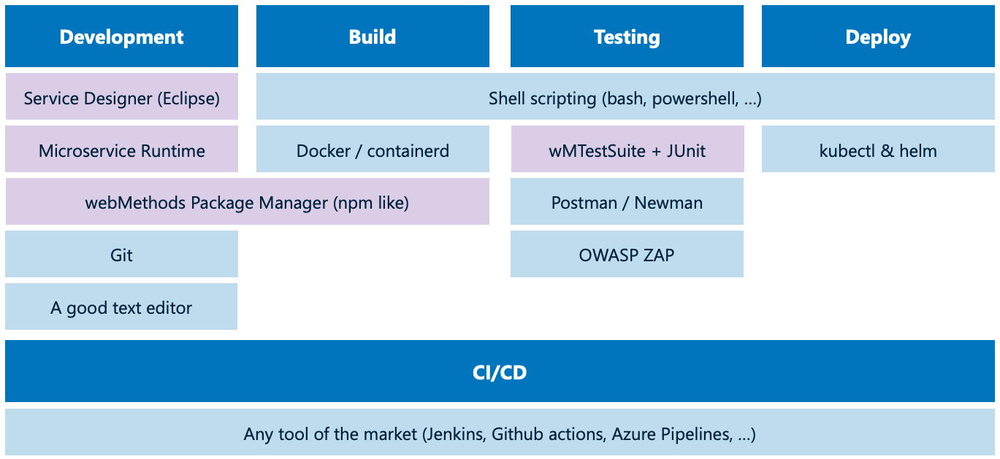
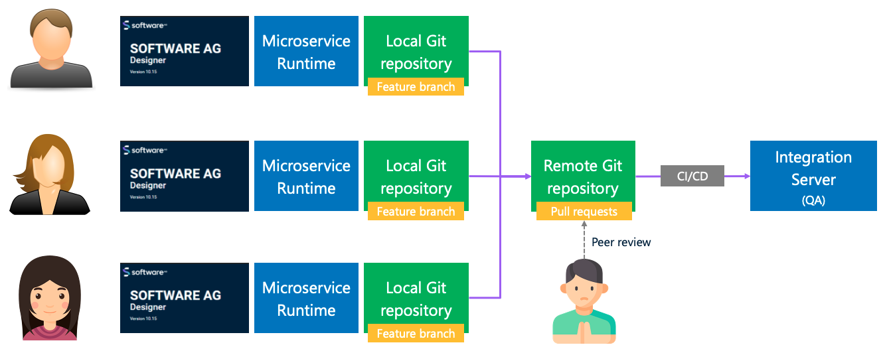

# Development environment setup

## Development tools

Most of the tools we see here are also used to implement, test and deploy microservices implemented using other languages and platforms.
The webMethods specifics are:
- the Service Designer, which is based on Eclipse
- the Microservice Runtime (MSR), which hosts the microservices
- the webMethods package manager (wpm), which works similar to npm or yarm in node.js
- wMTestSuite, which provides a framework for unit testing and uses a JUnit interface

The Service Designer, MSR and wMTestSuite can be downloaded here: https://tech.forums.softwareag.com/t/webmethods-service-designer-download/235227
The wpm is still in beta mode, it should be officially released by the end of 2023.

The microgateway isn't mentionned here. When I develop the microservice I usually do not work with a microgateway. I deal with it later when starting to deal with the deployment.

## Development methodology

Similar tools, similar organization, similar methodology (inspired by DevOps.)

In this diagram, replace the Service Designer and the MSR with IntelliJ and Spring Boot, or with Atom and node.js, and you get a development setup that's identical.

You use Git as a versioning control system and collaboration tool. All developers point to the same Git remote (can be Github, Gitlab, etc.) and they preferably make use of feature branches to deal with their changes.
When they're ready they create a pull request in the Git remote and another developer checks the change before merging it to the master (main) branch.
And then you've got a CI/CD pipeline that automatically starts and builds, tests, deploys (and probably tests again after the deployment.)
