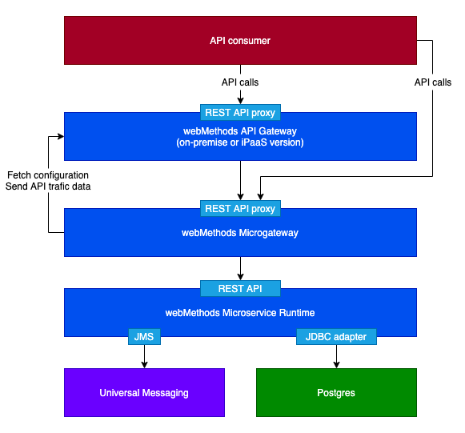

# Logical architecture

## Universal messaging (UM)

Universal messaging is used to implement the event driven architecture layer, which allows microservices to communicate in loosely coupled fashion using events and commands. The microservice publishes CustomerUpdate events that can be consumed by interested subscribers, following the publish/subscribe pattern.

Universal Messaging can be placed in any location that's accessible from the Kubernetes cluster, including inside the cluster.

## Database

The relational database simply stores customer information.

I'm pointing to an Azure management Postgres DB here. But any other location would do, as long as it's accessible from the Kubernetes cluster. Putting this DB inside the Kubernetes cluster is also a valid option.

## Microservice runtime (MSR)

The MSR is a lightweight distributed ESB, which exposes the microservice API, connects to all sorts of backend resources (including databases and messaging brokers), and deals with the mapping and transformation logic. It's the core component of our microservice.

It is deployed inside the Kubernetes cluster, within a deployment of pods.

## Microgateway and API gateway

API management is a usual concern in microservice architectures. We want a central point of governance for our microservices, dealing with access control, mediation, monitoring, documentation and possibly monetization.

Traditional API management relies on an API gateway, which works in a hub and spoke architecture. All flows transit through a central cluster. If you have several datacenters (or cloud regions) you can have several clusters of API gateways. But in a microservice architecture you would certainly not have one API gateway cluster for each microservice, it would be an overkill. Instead we use a microgateway.

The microgateway is another lightweight distributed component which focuses on API management. It's not an API gateway, its role is only to secure microservices' APIs at the source and forward API trafic logs to a central API gateway. We still have a central point of governance for our APIs (the central API gateway) but we have a multitude of distributed agents that sit near the microservices (in the Kubernetes cluster) and protect them.

The API gateway can be located anywhere, it just needs to be accessible from the Kubernetes cluster. Like the UM and the Database it can also be inside the Kubernetes cluster, but a serverless API Gateway will also be perfect for the job at hand.

## API consumer

There are two possible routes to consume the APIs exposed by the microservice:
-   direct calls to the microgateway
-   or calls to the central API gateway, which redirects the trafic to the microgateway in charge of protecting the microservice

The former approach is more distributed and robust, we can rely on all the benefits of Kubernetes: scalability, observability and repairability.
But while the microgateway deals with the API access control, it does not manage network threats like DDoS, SQL injection, poisonous XML/JSON payloads.
Most of these considerations can be managed by modern firewalls and applicative gateways. But in the absence of such network security components, making API consumers go through the API gateway becomes a sensible option.
