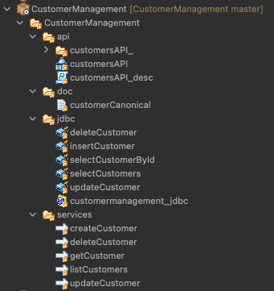
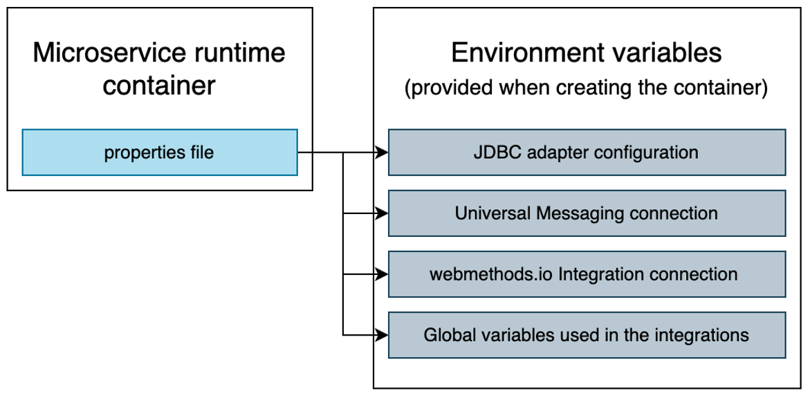

# Microservice implementation

## Internal design

We follow the recommended layered approach:
- a customerCanonical document type defining the Customer object
- a jdbc folder containing the JDBC adapter services
- a service folder containing the flow services, which invoke the JDBC adapter services to access the database and use the Customer document type
- an API folder containing the REST API descriptor and the mapping between the API methods and the flow services

There's not much difference between an API implemented in the "traditional" Integration Server and one implemented in a Microservice Runtime. The microservice specificities are at configuration, packaging and deployment levels.

## Microservice external configuration

We want our image to be "environment agnostic". The very same image will go to QA, UAT and later Production.
Everything that is environment specific needs to be externalized: connection to backend APIs, databases, messaging brokers, etc.
Same principle for the operating properties, such as the log level.

The MSR lets us provide a properties files to inject everything that is environment specific into the microservice container.
There are two ways of providing this file to the container:
- it can be outside the image and mounted into the container
- or it can be inside the image and point to environment variables that are passed to the container when it is launched

We use the second option here.

In both cases, we need to pass the location of the properties file to the MSR container using the SAG_IS_CONFIG_PROPERTIES environment variable.

## Microservice build and push

A Dockerfile is provided to build the microservice container image.
The base image is staillansag/webmethods-microservicesruntime:10.15.0.2-jdbc, which I created myself. It's the base MSR image provided in https://containers/softwareag.com, to which I have added the WmJDBCAdapter package along with the required JAR drivers.

In the Dockerfile we copy the content of the github repo (the content of the webMethods package) and two configuration files related to JNDI and JMS.

The Github repo also contains some assets that are not meant to be part of the Docker image, so we use a .dockerignore file to ensure we don't place things like the Kubernetes deployment manisfests, README pictures or CI/CD scripts into the image.

You would then push the image to any registry of your liking. It's a Docker image like any other.